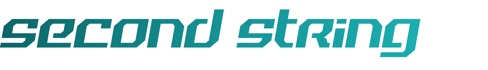

# SecondString

Second String aims to take a new look at sports statistcal analysis.  The website will project future performance of athletes across a wide variety of different sports.  

We will analyze career trends with miscellaneous other factors to try and provide an accurate projection of future performace.

Currently in the early stages of development.  We are focusing on the NFL first and are in the process of populating our Mongo Database and creating our actual website using the MEAN stack.

The Mongo DB is up and the website is connected to the DB and able to pull and display data.  We have added a dynamic table view for the player statistics and we are able to sort the table as
well as search from a search box we added.  We have been playing around with the color scheme to make the view more appealing.  Now we are focused on fully populating our database.  We have 
some data files that we are going to pull from and cross reference with online data.

To get started you will need to install node, more specifically npm on your computer.
https://nodejs.org/en/
From there you will want to navigate to the directory where you have cloned this repository and run the command "npm install" to install the packages we use.  Then you can see any edits you make to code by running npm start.  This should open a browser window displaying our website being locally run.

A list of available statistics for players can be found here:
https://github.com/BurntSushi/nflgame/wiki/Stat-types

A live version of the site is hosted on heroku at:
http://second-string-demo.herokuapp.com/
    
    
More information as well as a blog can be found here : rcos.io/projects/cwilliamson226/secondstring/profile
